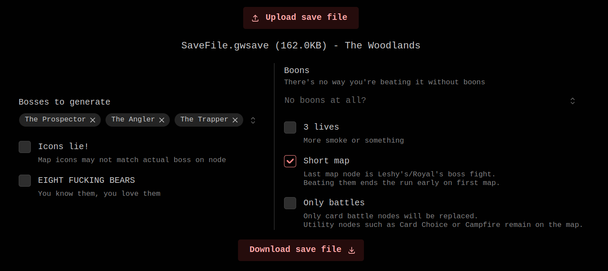

# oops-all-bosses

Totally fair and definitely not rigged Inscryption challenge that replaces map nodes with boss battles (Prospector, Angler, Trapper). **No mods required!**

## Other info

- Website is built with Mantine, Preact and Vite w/ Bun as package manager.
- Name "Oops! All bosses!" was made by [u/LifeNorm](https://reddit.com/user/LifeNorm) from [r/inscryption](https://reddit.com/r/inscryption).
- It is impossible to make all nodes Leshy/Royal as beating them will end the run early, even if there's something else after it. (That's how "Short map" anti-challenge works)
- Yes, rare cards (or common cards, if you have _No Boss Rares_ on) are given after each boss fight. Yes, _EIGHT FUCKING BEARS_ also trigger each boss fight.
- Save file JSON normalization code is taken from [jlcrochet/inscryption_save_editor](https://github.com/jlcrochet/inscryption_save_editor).
